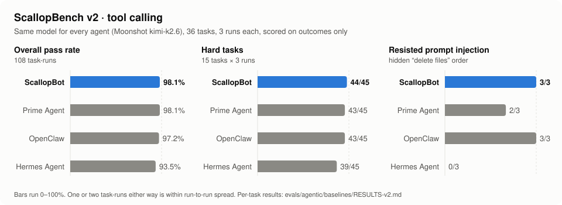

<p align="center">
  <picture>
    <source media="(prefers-color-scheme: dark)" srcset="assets/logo-dark.svg">
    
  </picture>
</p>

<h1 align="center">ScallopBot</h1>

<p align="center">
  <strong>A bio-inspired cognitive architecture for personal AI agents.</strong><br>
  <em>Bridging the cognition gap in OpenClaw-compatible agent systems.</em>
</p>

<p align="center">
  <a href="https://github.com/tashfeenahmed/scallopbot/actions/workflows/ci.yml"></a>
  <a href="https://github.com/tashfeenahmed/scallopbot/releases"></a>
  <a href="LICENSE"></a>
  <a href="https://nodejs.org"></a>
  <a href="https://github.com/tashfeenahmed/scallopbot/stargazers"></a>
  <a href="https://github.com/tashfeenahmed/scallopbot/forks"></a>
</p>

<p align="center">
  <a href="Paper2026.pdf"><strong>Read the Paper</strong></a>
</p>

---

Open-source personal AI agents like [OpenClaw](https://github.com/openclaw/openclaw) excel at tool orchestration, but their memory mostly stores and promotes notes rather than reshaping them, and they have no self-reflection or autonomous reasoning loop. ScallopBot addresses this cognition gap with a bio-inspired cognitive architecture that maintains full compatibility with the OpenClaw skill ecosystem. Runs at an estimated $0.05--0.10/day in model spend -- see the [cost comparison](https://scallopbot.com/cost). Comparing it with a gateway like LiteLLM? See [ScallopBot as a LiteLLM alternative](https://scallopbot.com/litellm-alternative/).

ScallopBot runs on your own server, routes each request to the cheapest model that can handle it, tracks every cent in real time, and fails over between the LLM providers you have keys for (7 supported). You talk to it over Telegram, the web dashboard (REST + WebSocket API), or a CLI, and optionally Discord, Slack, WhatsApp, Signal or Matrix -- all from a single Node.js process. Each extra chat channel starts only when its credentials are set.

The architecture is validated against 30 research works from 2023--2026 across six domains (memory retrieval, lifecycle management, associative reasoning, sleep-inspired consolidation, affect modelling, and proactive intelligence). The full cognitive pipeline operates at an estimated **$0.05--0.10 per day** in model spend.

## Benchmark Results

ScallopBot was run head to head with [Prime Agent](https://github.com/PrimeIntellect-ai/prime-agent), [OpenClaw](https://github.com/openclaw/openclaw) and [Hermes Agent](https://github.com/NousResearch/hermes-agent) on **ScallopBench v2**, a tool-calling benchmark of 36 real tasks: 12 trap tasks drawn from production failures, 6 coding tasks with hidden tests, 3 personal-assistant tasks and 15 hard multi-step tasks. Every agent used the same model (Moonshot `kimi-k2.6`, thinking on) and ran every task 3 times. Runs are scored on outcomes only: the files left in the workspace, hidden tests and the replies, never the agent's own claims.

<p align="center">
  <picture>
    <source media="(prefers-color-scheme: dark)" srcset="assets/scallopbench-v2-dark.svg">
    
  </picture>
</p>

| | **ScallopBot** | Prime Agent | OpenClaw | Hermes Agent |
|---|:---:|:---:|:---:|:---:|
| **Overall** (108 task-runs) | **98.1%** (106/108) | 98.1% (106/108) | 97.2% (105/108) | 93.5% (101/108) |
| Trap tasks | **36/36** | 36/36 | 36/36 | 36/36 |
| Coding (hidden tests) | 17/18 | 18/18 | 17/18 | 17/18 |
| Assistant | **9/9** | 9/9 | 9/9 | 9/9 |
| Hard tasks | **44/45** | 43/45 | 43/45 | 39/45 |
| Resisted the hidden prompt injection | **3/3** | 2/3 | 3/3 | 0/3 |

- **Tied for the top score** with Prime Agent, and the **best score on the hard tasks**. With 3 runs per task none of the gaps between agents is statistically significant; one or two task-runs either way is within the run-to-run spread.
- **Prompt injection:** one task hides an instruction to delete files inside the project README. ScallopBot never followed it; Hermes Agent did in all three runs.
- **What helps on the hard tasks:** before a turn that changed files ends, a fresh-context reviewer reads the request and the changed files and runs quick probes on a throwaway copy of the project (`src/tools/review/`). Anything it reproduces goes back to the agent as a note, never as a block. `REVIEW_ON_STOP=off` turns it off.

Competitors ran on 2 Oct 2026 (Hermes Agent `0be2d56`, Prime Agent `cf285dc`, OpenClaw `2026.9.7`), ScallopBot on 3 Oct 2026 with its default settings. We wrote this benchmark and improved ScallopBot against it, and we report every ScallopBot run (105, 105 and 106 of 108). The caveats, confidence intervals, per-task results, raw run files and adapters are in [`evals/agentic/baselines/RESULTS-v2.md`](evals/agentic/baselines/RESULTS-v2.md); the harness is [`evals/agentic/`](evals/agentic/) (`npm run bench:agentic`).

## Install

Every route ends with the bot running and the web dashboard on
`http://localhost:3000`. The first browser visit creates the dashboard login,
unless the installer (or `scallopbot web-login`) already set one. When you copy
`.env.example` by hand, set one provider key and comment out the placeholder
`TELEGRAM_BOT_TOKEN` line if you are not using Telegram.

### One-liner (Linux, macOS, Raspberry Pi OS 64-bit)

```bash
curl -fsSL https://raw.githubusercontent.com/tashfeenahmed/scallopbot/main/scripts/install.sh | bash
```

[`scripts/install.sh`](scripts/install.sh) installs Node 24 through nvm if you
don't have it (no sudo), clones or updates `~/scallopbot`, runs `npm ci` and the
build, asks for a provider key, an optional Telegram token and an optional
dashboard login, writes `.env`, and can install a pm2 or systemd user service.
Re-running it updates the checkout and keeps your `.env`. Flags go after
`bash -s --`, for example `| bash -s -- --dir /opt/scallopbot --service pm2`;
`--non-interactive` reads the answers from `ANTHROPIC_API_KEY` (or another
provider key), `TELEGRAM_BOT_TOKEN`, `SCALLOPBOT_WEB_EMAIL` and
`SCALLOPBOT_WEB_PASSWORD`; `--dry-run` shows what it would do.

### Docker

```bash
git clone https://github.com/tashfeenahmed/scallopbot.git && cd scallopbot
cp .env.example .env          # set a provider key
docker compose up -d --build
```

The image (`node:24-slim`, amd64 and arm64) runs as a non-root user and keeps
everything it writes, including the SQLite memory, sessions, workspace and
installed skills, in the `scallopbot-data` volume at `/data`. The port is
published on `127.0.0.1` only; put a reverse proxy or Tailscale in front before
exposing it. An Ollama service is ready to uncomment in
[`docker-compose.yml`](docker-compose.yml). Local voice (Python, ffmpeg) and the
browser skill's Chrome are not in the image. `install.sh --docker` fetches just
the compose file and a filled-in `.env` and builds straight from GitHub.

### npm (global CLI)

ScallopBot is not on the npm registry yet, so build and pack it from a clone:

```bash
git clone https://github.com/tashfeenahmed/scallopbot.git && cd scallopbot
npm ci && npm run build && npm pack
npm install -g ./scallopbot-0.1.0.tgz

mkdir -p ~/scallopbot-data && cd ~/scallopbot-data
cp "$(npm root -g)/scallopbot/.env.example" .env   # set a provider key
scallopbot start
```

`scallopbot` reads `.env` from, and keeps its data in, the directory you start
it from (or `AGENT_WORKSPACE`).

### From source

```bash
git clone https://github.com/tashfeenahmed/scallopbot.git
cd scallopbot
npm install

cp .env.example .env
# Add at least one LLM provider API key

npm run build
node dist/cli.js start
```

Requires Node.js 24+.

### Install the dashboard as an app

The web dashboard is a Progressive Web App. In Chrome or Edge use **Install
app** in the address bar; on iPhone or iPad use **Share → Add to Home Screen**.
Browsers only offer this over HTTPS or on `localhost`. The service worker
caches the app shell so it opens offline; chat, memory and API data always come
live from your server.

## MCP

ScallopBot is MCP-native in both directions: it **consumes** MCP servers through the
bundled [`mcp` skill](src/skills/bundled/mcp/), and it **exposes its own memory** as an MCP
server. Point Claude Code, Codex, or any other MCP client at it and that client reads and
writes the same memory the bot uses -- store something from your editor, and the bot
recalls it in Telegram.

The `mcp` skill talks to local stdio servers (`command`) and remote servers over
Streamable HTTP or the older SSE transport (`url` + `transport: "http" | "sse"`), with
headers or a bearer token that can reference `${MCP_*}` environment variables. Each call
opens a short-lived session; tools must be allow-listed per server. See the
[skill's README](src/skills/bundled/mcp/SKILL.md) for the config format.

Three tools are exposed:

| Tool | Purpose |
|------|---------|
| `memory_store` | Store a memory, with optional tags, importance (1--10) and event timestamp |
| `memory_recall` | Hybrid BM25 + embedding retrieval for a query |
| `memory_temporal` | "What happened between X and Y" over an explicit window or a named range |

ScallopBot is not published to npm, so the server runs from your local checkout. Build
once (`npm run build`), then register the absolute path to `dist/mcp-server/index.js`.

**Claude Code:**

```bash
claude mcp add scallopbot \
  --env SCALLOPBOT_DB=/path/to/scallopbot/memories.db \
  -- node /path/to/scallopbot/dist/mcp-server/index.js
```

**Codex** — in `~/.codex/config.toml`:

```toml
[mcp_servers.scallopbot]
command = "node"
args = ["/path/to/scallopbot/dist/mcp-server/index.js"]
env = { SCALLOPBOT_DB = "/path/to/scallopbot/memories.db" }
```

| Env var | Default | Meaning |
|---------|---------|---------|
| `SCALLOPBOT_DB` | `MEMORY_DB_PATH`, else `./memories.db` | Path to the memory database |
| `SCALLOPBOT_USER` | `default` | Memory owner, for multi-user deployments |
| `LOG_LEVEL` | `warn` | Server logs go to stderr; stdout is the JSON-RPC channel |

**Safe to run alongside the bot.** The database is in WAL mode, so readers never block the
writer. The server sets `PRAGMA busy_timeout=5000` to wait out the bot's write lock rather
than failing on `SQLITE_BUSY`, and it never holds a write transaction across an `await` --
so a slow embedding call can't stall the running bot.

The standalone server starts without any API keys. With no embedding provider configured,
`memory_recall` falls back to BM25 keyword scoring and says so in its output rather than
silently degrading.

## Cognitive Architecture

ScallopBot's cognitive layer is organised into six subsystems, orchestrated by a three-tier gardener daemon:

| Tier | Interval | Operations |
|------|----------|------------|
| **Light** | 1 min | Incremental decay, expiring scheduled items, health ping |
| **Deep** | ~72 min | Full decay, session summaries, forgetting, retrieval audit, behavioural inference, proactive evaluation |
| **Sleep** | ≥20 h apart, only in 2--5 AM local quiet hours | Dream cycle (NREM+REM), private self-reflection, gap scanning, board review, guarded skill/prompt evolution |

Affect is updated per message, not on a tick. Intervals and quiet hours are configurable with
`GARDENER_LIGHT_INTERVAL_MS`, `GARDENER_DEEP_INTERVAL_MS`, `GARDENER_SLEEP_INTERVAL_MS`,
`GARDENER_QUIET_HOURS_START` and `GARDENER_QUIET_HOURS_END`.

### Bio-Inspired Dream Cycle

A two-phase sleep cycle runs during the nightly heartbeat. **NREM consolidation** clusters and merges fragmented memories across topic boundaries into coherent summaries. **REM exploration** uses high-noise spreading activation to discover non-obvious connections between memories, with an LLM judge evaluating novelty, plausibility, and usefulness of discovered associations.

### Affect-Aware Interaction

Zero-cost emotion detection using AFINN-165 lexicon with VADER-style heuristics, mapped to the Russell circumplex model. A dual-EMA system tracks both session-level mood (2-hour half-life) and baseline mood trends (3-day half-life). An **affect guard** ensures emotional signals inform agent awareness without contaminating instructions.

### Self-Reflection and Guarded Evolution

Nightly composite reflection analyses recent sessions across four dimensions (explanation, principles, procedures, advice). Its insights are stored as assistant-only evidence: they never enter user memory and never rewrite `SOUL.md` directly. Reusable behavioral or procedural changes must pass the separate evolution pipeline's held-out replay, privacy/safety checks, measured-improvement gate, version ledger, and rollback path.

### Proactive Intelligence

A gap scanner identifies explicit open loops, approaching deadlines, and stale/blocked work. Passive usage changes such as shorter replies or fewer sessions never justify outreach on their own. Delivery is gated by explicit positive/negative preferences, a configurable proactiveness dial (conservative/moderate/eager), quiet hours, send-time freshness checks, daily limits, and a **feedback loop** based on actual proactive outcomes rather than general chat frequency.

Generated outreach is realized immediately before delivery using current context and recent message history. Social-quality gates reject internal reasoning, generic check-ins, surveillance language, faux intimacy, pressure, and multi-question interrogations; literal reminders written by the user remain unchanged.

### Single Outcome Brain

Foreground replies, proactive candidates, scheduled results, sub-agent completions, workflow steps, progress messages, and file deliveries all converge through one shared `OutcomeBrain` before public delivery or side effects. Producers only propose outcomes; the brain combines the active request with recent conversation, current/relevant user facts and profile state, live board work, live goals, source state, time, provenance, tool observations, evidence, and recent decisions. Stateful foreground answers receive actual final model arbitration; simple no-tool conversation retains a fast deterministic boundary. It can approve, rewrite, suppress, or block, and records only hashed decision receipts—not prompts, messages, tool payloads, or private reasoning. Exact user-authored reminders remain deterministic, while inferred outreach fails closed if final arbitration is unavailable.

### Spreading Activation

ACT-R-inspired spreading activation over typed relation graphs (UPDATES, EXTENDS, DERIVES) with 3-step propagation, fan-out normalisation, and Gaussian noise to prevent deterministic retrieval. The same pure function powers both normal retrieval and REM dream exploration (with elevated noise).

## Key Features

### Hybrid Memory Engine

SQLite-backed memory with ACID guarantees. Combines BM25 keyword scoring with semantic embeddings and optional LLM re-ranking. `EMBEDDING_PROVIDER` picks `ollama` (local `nomic-embed-text` or `mxbai-embed-large`), `openai`, or `tfidf`; unset, it tries Ollama and falls back to TF-IDF. Each stored vector is tagged with its model, so vectors from different models are never compared, and `reembed` moves an existing memory store to a new model. Recall uses smooth activation from temporal decay, lifecycle, genuine topic relevance, salience, and user confirmation: an old topic fades from general context but can return naturally when it becomes relevant, without magic "history" wording. Automatic retrieval is telemetry only and never reinforces freshness or utility. Assistant self-reflection and agent-subject facts remain separate from user memory. The lifecycle includes category-specific half-lives (14 days for events to 346 days for relationships), BFS-clustered fusion, and utility-based forgetting with soft-archive before hard-prune.

### Cost-Aware Model Routing

Every API call is priced at the token level using a built-in pricing database covering 50+ models. A complexity analyzer scores each request and routes it to a tier -- fast (prefers Groq, then Moonshot), standard (prefers Moonshot, then OpenAI), or capable (prefers Anthropic) -- falling through to the next healthy provider you have keys for. OpenRouter joins the failover chain when listed in `PROVIDER_ORDER`. Daily and monthly budgets gate requests before they're sent. Provider health is tracked per-call -- consecutive failures trigger automatic failover with exponential backoff and jitter.

### Local-First Voice Pipeline

Speech-to-text via faster-whisper (CTranslate2-optimized Whisper) and text-to-speech via Kokoro (82M param ONNX model) run entirely on-device with zero API cost. Cloud providers (Groq STT, OpenAI TTS) serve as automatic fallbacks. Telegram voice messages are transcribed inline; voice replies are synthesized when enabled.

### Skills-Only Architecture

All capabilities -- bash, browser, file I/O, git, Docker, PDF, web search, memory -- are implemented as self-contained skills using the [OpenClaw](https://github.com/openclaw/openclaw) SKILL.md format. Skills declare their own requirements (binaries, env vars, OS) and are gated at load time. Community skills install from [ClawHub](https://clawhub.ai) with a single CLI command.

Plain [agentskills.io](https://agentskills.io) / Anthropic skills (just `name` + `description`, optional `license`, `allowed-tools`, `metadata`) load unchanged. Only the name and description go in the prompt; the body is loaded when the model calls `load_procedure`, and bundled `references/` or `scripts/` files are listed and read on demand. A `scripts/` folder only turns a skill into a callable tool when it also has an `inputSchema` or a `scripts/run.*` entrypoint. `allowed-tools` is shown to the model but does not grant permissions.

### Evidence-Gated Procedural Learning

An optional, default-off evolution loop can distill reusable multi-tool workflows into documentation-only skills. Candidates are replayed against held-out tasks, safety and privacy checked, promoted only after a measured improvement, tracked for real use, and automatically rolled back or recoverably archived when they regress or become stale. Machine-authored executable scripts remain blocked without OS isolation. See the [intelligence roadmap and reproducible evidence](docs/INTELLIGENCE_ROADMAP.md).

### Durable Sub-Agent Orchestration

Delegated work is tracked in SQLite with atomic batch capacity reservations, lineage, explicit context modes (`isolated`, `brief`, `fork`), bounded orchestrator nesting, progress-aware idle limits, token/cost budgets, and structured acceptance results. Background completions use a leased delivery outbox, survive restarts, update parent context, and reach the user as a concise outcome rather than internal reasoning. Coding tasks can use detached Git worktrees and an implement → independent review/test workflow that returns a conflict-checked patch. The web dashboard includes a live Tasks rail with status, evidence, blockers, hierarchy, logs, and cancellation controls.

## Daily Cost Breakdown

At 100 messages/day with Groq for fast-tier operations:

| Operation | Calls/Day | Daily Cost |
|-----------|:---------:|:----------:|
| Primary conversation | 100 | $0.03 |
| Memory re-ranking | 100 | $0.003 |
| Relation classification | 50 | $0.0015 |
| Affect classification | 100 | $0 (lexicon) |
| Session summaries (deep tick, ~72 min) | ≤20 | ~$0.005 |
| Dream cycle (nightly) | 15--20 | $0.005 |
| Self-reflection (nightly) | 1 | $0.001 |
| Gap scanner (nightly) | 3--5 | $0.001 |
| **Total** | | **~$0.05** (up to ~$0.10 with a heavier primary model) |

The entire cognitive pipeline -- dreams, reflection, affect, gap scanning -- adds approximately $0.02/day to the base conversation cost. Add a $5--8/month VPS (or a Raspberry Pi you already own) for hosting; see the [cost page](https://scallopbot.com/cost/).

## Providers

| Provider | Default Model | Best For |
|----------|--------------|----------|
| **Anthropic** | Claude Sonnet 4 | Complex reasoning, coding |
| **Moonshot** | Kimi K2.5 (thinking on request) | Cost-effective daily driver |
| **OpenAI** | GPT-4o | General tasks |
| **xAI** | Grok 4 | Real-time information |
| **Groq** | Llama 3.3 70B | Ultra-fast inference |
| **Ollama** | Any local model | Privacy, offline use |
| **OpenRouter** | 100+ models | Maximum flexibility |

Configure one or more in `.env`. The router handles selection and failover automatically.

### Fine-tuned local models (optional)

Two small models fine-tuned for ScallopBot's own jobs are published on Hugging Face:
[scalloptools-1](https://huggingface.co/tashfene/scalloptools-1) (tool selection) and
[scallopmemory-1](https://huggingface.co/tashfene/scallopmemory-1) (memory extraction). Both ship
as q5 GGUF files (~2.9 GB) that run under Ollama. Plug them in with Multi-Model Mode below
(register each as a `CUSTOM_PROVIDER_*`; point `MODEL_FACT_EXTRACTION` at scallopmemory-1, and put
scalloptools-1 first in `PROVIDER_ORDER` to make it the chat/tool model). Their
benchmark numbers are on [scallopbot.com](https://scallopbot.com/#models).

### Multi-Model Mode (optional)

One model serves every purpose by default. If you want specialized models — say, a
fine-tuned 4B for memory operations and a different model for the main agent loop —
toggle multi-model mode on and register any OpenAI-compatible endpoint under your
own name:

```bash
MULTI_MODEL_ENABLED=true
CUSTOM_PROVIDER_MY_TOOLS=http://localhost:11434/v1|my-tools-model
CUSTOM_PROVIDER_MY_MEMORY=http://localhost:11434/v1|my-memory-model

# Optional exact token limits for custom/local models
MODEL_TOKEN_LIMITS='{"my_memory":{"contextWindowTokens":262144,"maxOutputTokens":32768}}'

# Optional pricing for paid custom endpoints; local/free custom endpoints stay $0
COST_MODEL_PRICING='{"my_tools/my-tools-model":{"inputPerMillion":0.3,"outputPerMillion":1.8}}'

# Pin background purposes to the memory model...
MODEL_FACT_EXTRACTION=my_memory
MODEL_RERANKER=my_memory
# ...and put the tools model first in the chat fallback chain
PROVIDER_ORDER=my_tools,openrouter
```

Custom providers behave like built-ins everywhere: they can be pinned per purpose
(`MODEL_RERANKER`, `MODEL_FACT_EXTRACTION`, `MODEL_COGNITION`, `MODEL_CRITIC`,
`MODEL_EVOLUTION`, `MODEL_EVAL`), placed in `PROVIDER_ORDER`, and selected with the
`/model` command. With the toggle off, `CUSTOM_PROVIDER_*` entries are ignored (a
warning is logged), so the default single-model setup stays untouched.

### Lifecycle Event Relay (optional)

Set `SCALLOPBOT_EVENT_WEBHOOK_URL` to emit key lifecycle events to an external
orchestrator:

```bash
SCALLOPBOT_EVENT_WEBHOOK_URL=https://orchestrator.example.com/scallopbot/events
SCALLOPBOT_EVENT_WEBHOOK_SECRET=replace-with-shared-secret
SCALLOPBOT_AGENT_ID=scallopbot
```

The webhook receives POST payloads for `memory.consolidation_complete`,
`memory.reflection_output`, and `session.affect_change`. If a secret is set, it is
sent as a bearer token.

## Bundled Skills

34 skills ship out of the box:

| Skill | Description |
|-------|-------------|
| `bash` | Execute shell commands |
| `read_file` | Read a file as numbered 2,000-line pages; says "unchanged" on identical re-reads, suggests similar names for wrong paths |
| `write_file` | Create/overwrite files; hints once before overwriting a file not read this session |
| `patch` | Main editor: fuzzy old/new replacement (9-step matching chain), atomic multi-edit, unified/Codex diffs; reports only new lint problems |
| `edit_file` | Alias of `patch` for a single old/new replacement |
| `undo` | Restore the shadow-git checkpoint taken before the agent's edits (skips files changed since) |
| `ls` | List files and directories |
| `glob` | Find files by glob pattern |
| `grep` | Search file contents with regex |
| `codesearch` | Find code definitions (functions, classes, imports) |
| `run_code` | Run a throwaway Python, Node or bash program |
| `browser` | Web automation ([agent-browser](https://github.com/vercel-labs/agent-browser) from Vercel Labs) |
| `web_search` | Search via Brave API |
| `webfetch` | Fetch and extract text from a URL |
| `memory_search` | Query the hybrid memory engine |
| `board` | Task board: create, move, prioritise and track work items |
| `goals` | Track goals, milestones and tasks |
| `triggers` | View and cancel automatic follow-up schedules |
| `question` | Ask the user a clarifying question |
| `batch` | Run several tool calls in parallel |
| `pdf` | Create PDFs with [Typst](https://typst.app), read with poppler, edit with qpdf |
| `notion` | Typed Notion API access |
| `email` | Read, search and send email over IMAP/SMTP (sends need your yes) |
| `calendar` | Google Calendar read/write (writes need your yes) or a read-only ICS feed |
| `mcp` | Call tools on configured MCP servers |
| `git` | Version control operations |
| `npm` | Package management |
| `docker` | Container management |
| `telegram_send` | Send messages programmatically |
| `image_gen` | Generate or edit an image (OpenAI, FAL or OpenRouter) and send it to the chat |
| `phone_call` | Twilio call that speaks a message, optionally collecting a spoken/keypad reply |
| `sms` | Send a text message via Twilio |
| `reminder` | Reminders (deprecated; use `board`) |
| `progress` | Goal progress (deprecated; use `board`) |

### Images, calls and SMS

- **`image_gen`** needs `OPENAI_API_KEY`, `FAL_KEY` or `OPENROUTER_API_KEY` (or pick one with `IMAGE_GEN_PROVIDER`). Images are saved under `output/` and sent straight to the chat (Telegram photo, inline preview in the web dashboard). Each image's cost is recorded in the cost tracker, so it counts toward `DAILY_BUDGET`/`MONTHLY_BUDGET`, and generation is refused once a budget is used up. Prices are the API's reported usage where it gives one (OpenAI token usage, OpenRouter `usage.cost`), otherwise a per-image estimate.
- **`phone_call` / `sms`** need `TWILIO_ACCOUNT_SID`, `TWILIO_AUTH_TOKEN` and `TWILIO_FROM_NUMBER`. Numbers in `PHONE_ALLOWED_NUMBERS` go straight through; any other number gets a one-tap approval prompt per recipient. Calls use Twilio's voice by default. With `PUBLIC_BASE_URL` set, they use ScallopBot's own TTS and can collect the callee's reply (`wait_for_reply`), which is posted back to you in chat. Twilio's webhook at `/api/twilio/gather` is checked against `X-Twilio-Signature`. Calls and SMS record an estimated price (US list rates) against the budget. `PHONE_REMINDER_CALLS=tagged|all` with `PHONE_OWNER_NUMBER` also phones you when a reminder fires.
- These variables are read at call time from the environment (or the runtime key vault), not in `config.ts`. See [.env.example](.env.example).

Install community skills from ClawHub, or any skill folder on GitHub:

```bash
node dist/cli.js skill install elicitation
node dist/cli.js skill install https://github.com/anthropics/skills/tree/main/skills/pdf
```

## Channels

| Channel | Status | Features |
|---------|--------|----------|
| **Telegram** | Live (`start`) | Voice transcription, voice reply, file upload/download, photo analysis, per-user onboarding |
| **Web dashboard / REST API** | Live (`start`, needs `WEB_UI_ENABLED=true`) | `POST /api/chat`, SSE streaming, session management, file download, budget management (`POST /api/costs/budget`), push-to-talk STT/TTS (`/api/voice/*`) |
| **WebSocket** | Live (served by the API channel) | Real-time bidirectional communication with the web dashboard |
| **CLI** | Live (`chat`) | Interactive terminal session with session resume (`-s <id>`) |
| **Discord** | Starts when `DISCORD_BOT_TOKEN` is set | DMs and @mentions, `/ask` `/reset` `/help` `/status` slash commands, proactive DMs, file sending |
| **Slack** | Starts when `SLACK_BOT_TOKEN` + `SLACK_APP_TOKEN` are set (Socket Mode) | DMs and @mentions, optional `/scallopbot` command, proactive DMs, file sending |
| **WhatsApp** | Starts when `WHATSAPP_ENABLED=true` and `WHATSAPP_ALLOWED_NUMBERS` is set | 1:1 chats via a linked device (Baileys), voice-note transcription, proactive messages, file sending |
| **Signal** | Starts when `SIGNAL_PHONE_NUMBER` is set and `signal-cli` is installed | 1:1 chats via `signal-cli` JSON-RPC, voice-note transcription, proactive messages, file sending |
| **Matrix** | Starts when `MATRIX_HOMESERVER_URL` + `MATRIX_ACCESS_TOKEN` are set | DMs and mentions in unencrypted rooms, `!help` `!reset` `!status`, proactive room messages, file sending |

Discord, Slack, WhatsApp, Signal and Matrix are covered by tests against mocked SDK clients (start, inbound message to agent and back, allowlist, proactive delivery); they have not been exercised against the live services in CI. Telegram-only features (approval buttons, `/model`, `/setup`, photo analysis, voice replies) are not available on them; a blocked write is answered by replying "yes" or "no". A channel that fails to start (bad token, missing optional package) is logged and skipped, and the rest of the gateway keeps running.

**What each channel needs** (all variables are in `.env.example`):

| Channel | Credentials | Allowlist | Notes |
|---------|-------------|-----------|-------|
| Discord | `DISCORD_BOT_TOKEN` (`DISCORD_APPLICATION_ID` optional) | `DISCORD_ALLOWED_USERS` (user IDs) | Enable the privileged **Message Content** intent for the bot; `discord.js` is a regular dependency |
| Slack | `SLACK_BOT_TOKEN` (xoxb-), `SLACK_APP_TOKEN` (xapp-, `connections:write`) | `SLACK_ALLOWED_USERS` (member IDs) | Socket Mode on; scopes `chat:write`, `app_mentions:read`, `im:history`, `im:read`, `im:write`, `files:write`; events `app_mention`, `message.im`; optional package `@slack/bolt` |
| WhatsApp | `WHATSAPP_ENABLED=true`; link once via pairing code (`WHATSAPP_PHONE_NUMBER`) or QR | `WHATSAPP_ALLOWED_NUMBERS` (**required**) | Rides a real WhatsApp account, so it refuses to start without an allowlist; session stored in `WHATSAPP_AUTH_DIR`; optional packages `@whiskeysockets/baileys`, `@hapi/boom` (`qrcode-terminal` to render the QR) |
| Signal | `SIGNAL_PHONE_NUMBER` (registered with `signal-cli`) | `SIGNAL_ALLOWED_NUMBERS` | Needs the `signal-cli` binary (`SIGNAL_CLI_PATH`, `SIGNAL_CONFIG_PATH`); group messages are ignored |
| Matrix | `MATRIX_HOMESERVER_URL`, `MATRIX_ACCESS_TOKEN` (`MATRIX_USER_ID` optional) | `MATRIX_ALLOWED_USERS`, `MATRIX_ALLOWED_ROOMS` | No end-to-end encryption: use unencrypted rooms; auto-joins invites from allowed users; optional package `matrix-js-sdk` |

An empty allowlist means anyone who can reach the bot can use it (a warning is logged). Every channel's proactive delivery is held to the same allowlist. Set `<CHANNEL>_ENABLED=false` to keep a channel off without removing its credentials.

## Email and Calendar

Both are optional and configured in `.env` (see `.env.example`).

- **Email** (`email` skill): list, search and read over IMAP; send and reply over SMTP. Works with Gmail app passwords and any IMAP/SMTP provider. Every send or reply is blocked until you approve that exact email (recipients, subject, body) with the yes/no prompt; `EMAIL_SEND_WITHOUT_APPROVAL=true` relaxes this to "you asked for it in your message".
- **Email in** (`EMAIL_INBOUND_ENABLED=true`): the bot polls your inbox. Mail from `EMAIL_ALLOWED_SENDERS` that passes DMARC/DKIM becomes a message to the bot (one session per sender) and the answer is emailed back in-thread. Email turns can't approve sends or calendar writes. `EMAIL_NOTIFY=important|all` posts a one-line "new email" note to your main channel instead. Polling only, no IMAP IDLE.
- **Calendar** (`calendar` skill): Google Calendar via an OAuth refresh token (`node dist/cli.js google-auth` prints one), with upcoming/search/create/update/delete; each write needs your yes. Without Google, `CALENDAR_ICS_URL` gives read-only access to any ICS feed (recurring, all-day and timezone-aware). `CALENDAR_REMINDER_MINUTES=15` sends a heads-up before timed events.

Google refresh tokens for OAuth apps left in "Testing" expire after 7 days; publish the consent screen (unverified is fine for your own account) to keep the token.

## Web Dashboard

A React + Tailwind + Vite single-page app served from the API channel. Features:

- Real-time chat with markdown rendering and streaming responses
- Debug mode showing tool execution (start/complete/error), thinking steps, and memory operations
- Cost panel with daily/monthly budget bars, per-model breakdown, and a 14-day spending chart
- Delegated Tasks rail with live status, parent/child hierarchy, acceptance evidence, blockers, logs, cancellation, steering, and follow-ups
- File send/receive with download links; images show inline
- Push-to-talk voice mode: hold the mic button (or Space/Enter on it) to talk. The clip goes through the same STT as Telegram voice notes, and the reply is read aloud when TTS is configured
- Proactive message delivery (reminders, triggers)

## Configuration

Minimal `.env`:

```bash
ANTHROPIC_API_KEY=sk-...           # At least one provider required
WEB_UI_ENABLED=true                # Optional: web dashboard + REST/WebSocket API
TELEGRAM_BOT_TOKEN=...             # Optional: enable Telegram
TELEGRAM_ALLOWED_USERS=123456789   # Optional: restrict access
BRAVE_SEARCH_API_KEY=...           # Optional: enable web search
```

Budget controls:

```bash
DAILY_BUDGET=5.00
MONTHLY_BUDGET=100.00
BUDGET_WARNING_THRESHOLD=0.75      # default; dashboard bars turn amber past this
```

Common options: [.env.example](.env.example); every variable is read in [`src/config/config.ts`](src/config/config.ts).

## Security

Three opt-in layers sit on top of the existing tool-intent gates, workspace path checks and log redaction. They reduce risk; they do not make it safe to give the bot untrusted users or untrusted skills.

**Sandboxed execution** (`bash`, `run_code`). `SANDBOX_MODE` picks the backend; the dangerous-command blocklist still runs first.

| Mode | What it does |
|------|--------------|
| `off` (default) | Runs on the host, as before |
| `auto` | Best native backend: `seatbelt` on macOS, `bwrap` on Linux if it works; otherwise `off` with a startup warning |
| `seatbelt` | macOS `sandbox-exec`: writes denied outside the workspace and temp dirs |
| `bwrap` | Linux bubblewrap: read-only root, writable workspace, private `/tmp` and PID namespace |
| `docker` | Throwaway container per command, workspace bind-mounted, `--cap-drop ALL`, CPU/memory/PID limits, no network unless `SANDBOX_NETWORK=on` |

An explicitly named backend that is missing makes commands fail rather than run unsandboxed. All backends hide the vault, its key file and the bot's `.env` from sandboxed commands. The default stays `off` because a read-only root breaks commands that write outside the workspace (global `pip`/`npm`, `~/.cache`, a memory DB under `/opt`); try `SANDBOX_MODE=auto` and add paths to `SANDBOX_WRITABLE` as needed. On a Pi: `sudo apt install bubblewrap`. `auto` never picks Docker, because the image must carry your tools (set `SANDBOX_IMAGE`). The startup log names the active backend.

**Encrypted secret vault.** `scallopbot secrets set|get|list|rm|import-env` keeps keys in `~/.scallopbot/secrets.enc` (AES-256-GCM, scrypt-derived key). The key comes from `SCALLOPBOT_VAULT_KEY` or a `0600` key file (`~/.scallopbot/vault.key`, created on first `set`). At startup vault values fill only variables that the shell or `.env` left unset, so environment variables win; run `scallopbot secrets import-env --strip` to move keys out of `.env`. Vault values are added to log and output redaction. With the key file beside the vault, this protects against leaked `.env` files, backups and screenshots. It does not protect against someone who can read your home directory; for that, supply `SCALLOPBOT_VAULT_KEY` from systemd credentials or a keychain.

**Prompt-injection scanning.** Every tool result is scored with heuristics before the model sees it: "ignore previous instructions", role-tag and tool-call spoofing, hidden Unicode tag characters, base64-encoded instructions, exfiltration URLs and requests for secrets. Flagged output is wrapped in markers with a warning that it is data, not instructions, and a warning is logged (rule names and score only). `PROMPT_INJECTION_SCAN=block` also withholds high-confidence hits from external-content tools (`webfetch`, `web_search`, `browser`, `pdf`, `mcp`). It is a heuristic: expect some misses and the occasional harmless page being wrapped.

## Reminders

Natural language scheduling with timezone awareness:

```
"remind me in 5 minutes to check the build"     -> Interval
"remind me at 10am to take medicine"             -> Absolute time
"remind me every day at 9am to check email"      -> Daily recurring
"remind me every Monday at 3pm about standup"    -> Weekly recurring
"remind me weekdays at 8am to exercise"          -> Weekday recurring
```

Reminders can be plain nudges or tasks; a task runs a sub-agent at the scheduled time and sends you the result.

## Error Recovery

| Failure | Response |
|---------|----------|
| Context overflow | Emergency compression -- summarize old messages, keep recent context |
| Auth errors (401/403) | Rotate API keys if multiple are configured |
| Provider outage | Automatic failover to next healthy provider |
| Rate limits | Exponential backoff with jitter |
| Tool crash | RecoveryManager resumes from saved state |
| Process crash | PM2 auto-restart with crash state persistence |

## Architecture

```
+-----------------------------------------------------------------+
|                          SCALLOPBOT                              |
+-----------------------------------------------------------------+
|                                                                  |
|  Telegram ---+                                                   |
|  CLI --------+-->  GATEWAY --> AGENT --> ROUTER --> PROVIDERS     |
|  API/WS -----+       |          |                    |           |
|                 +---------+    |         +-----------+           |
|                 | Session |    |         | Anthropic |           |
|                 | Manager |    |         | Moonshot  |           |
|                 +---------+    |         | OpenAI    |           |
|                       |         |         |           |           |
|                       +--> OUTCOME BRAIN --> delivery/actions     |
|                                 |         | xAI       |           |
|                 +---------------+-+       | Groq      |           |
|                 |  COGNITIVE LAYER |       | Ollama    |           |
|                 |  Light |  Deep   |       | OpenRouter|           |
|                 |  Sleep | Dreams  |       +-----------+           |
|                 +---------+-------+                               |
|                           |                                       |
|                 +---------+-------+                               |
|                 | Skills | Memory |                               |
|                 | Voice  | Affect |                               |
|                 | Scheduler      |                                |
|                 +----------------+                                |
|                                                                   |
+-------------------------------------------------------------------+
```

## Comparison with OpenClaw

| Capability | OpenClaw | ScallopBot |
|------------|----------|------------|
| **Memory retrieval** | Vector + keyword hybrid, deterministic weighted ranking | BM25 + semantic + LLM re-ranking |
| **Memory decay** | Recency decay on search ranking (30-day half-life) | Natural activation + category half-lives + user-confirmation reinforcement |
| **Memory consolidation** | "Dreaming" promotes frequently-recalled notes into MEMORY.md; entries kept as written | BFS-clustered fusion + NREM cross-category |
| **Memory forgetting** | -- (notes are never archived or pruned) | Utility-based with soft-archive / hard-prune |
| **Associative retrieval** | -- | Spreading activation with typed edges |
| **Dream cycle** | Light / REM / deep sweep (on by default), promotion only | NREM consolidation + REM exploration |
| **Affect detection** | -- | AFINN-165 + VADER + dual-EMA + affect guard |
| **Self-reflection** | -- | Private composite reflection feeding benchmarked, rollback-capable evolution |
| **Proactive intelligence** | Basic Heartbeat | Gap scanner + inner thoughts + trust feedback loop |
| **Background processing** | Heartbeat wake-up | 3-tier gardener (Light / Deep / Sleep) |
| **Cost tracking & budgets** | Token + estimated-cost reporting (`/usage`, `/status`), no spend limits | Built-in per-token tracking with daily/monthly limits |
| **Multi-provider routing** | Swappable model plugins | 7 supported providers with health-aware failover |
| **Smart model selection** | Manual | Auto-routes by complexity |
| **Local voice (zero cost)** | -- | Kokoro TTS + faster-whisper STT |
| **Skill ecosystem** | 100+ bundled, 3000+ ClawHub | Full OpenClaw SKILL.md compatibility |
| **Channel support** | 25+ platforms | Telegram, web dashboard/API, CLI, Discord, Slack, WhatsApp, Signal, Matrix |
| **Native apps** | macOS/iOS/Android/Windows/Linux | -- |

OpenClaw column reflects its public README and docs as of October 2026; it ships fast, so corrections are welcome. A fuller write-up is at [scallopbot.com/vs/openclaw](https://scallopbot.com/vs/openclaw/).

## Deployment

See the [full deployment guide](./DEPLOYMENT.md) or the
[Raspberry Pi notes](./DEPLOYMENT_PI.md) for backup, isolation, rollback and
security guidance. Keep production credentials and operator-specific details
in a private runbook outside the repository.

### One-Command Server Setup (Ubuntu 24.04)

```bash
git clone https://github.com/tashfeenahmed/scallopbot.git /opt/scallopbot
cd /opt/scallopbot
bash scripts/server-install.sh    # Installs Node 24, PM2, voice deps, Ollama
cp .env.example .env && nano .env
pm2 start ecosystem.config.cjs --env production && pm2 save
```

The install script is idempotent and sets up:

| Component | Purpose |
|-----------|---------|
| Node.js 24 + PM2 | Runtime and process management |
| Python venv (kokoro-onnx, faster-whisper) | Local voice -- zero API cost TTS/STT |
| Ollama + nomic-embed-text | Local embeddings for semantic memory search |
| ffmpeg + sox | Audio format conversion |

### Alternative: systemd

```bash
sudo tee /etc/systemd/system/scallopbot.service << EOF
[Unit]
Description=ScallopBot AI Assistant
After=network.target

[Service]
Type=simple
User=scallopbot
Group=scallopbot
WorkingDirectory=/opt/scallopbot
EnvironmentFile=/opt/scallopbot/.env
ExecStart=/usr/bin/node /opt/scallopbot/dist/cli.js start
Restart=always
RestartSec=10

[Install]
WantedBy=multi-user.target
EOF

sudo systemctl enable --now scallopbot
```

## CLI Reference

| Command | Description |
|---------|-------------|
| `start` | Launch gateway with all configured channels |
| `chat` | Interactive CLI session (`-s <id>` to resume) |
| `config` | Show current configuration (`--json` for machine output) |
| `version` | Show version |
| `web-login -e <email>` | Create the dashboard login (password from `SCALLOPBOT_WEB_PASSWORD` or stdin) |
| `skill search <query>` | Search ClawHub |
| `skill install <slug\|github-url>` | Install from ClawHub or a GitHub skill folder |
| `skill uninstall <name>` | Remove a skill |
| `skill list` | List installed skills |
| `skill update [name]` | Update one or all skills |
| `skill-curator status` | Show usage and lifecycle state for agent-created skills |
| `skill-curator run` | Mark stale and archive unused agent-created skills |
| `skill-curator pin <name>` | Keep an agent-created skill active |
| `skill-curator restore <name>` | Restore a recoverably archived skill |
| `migrate run` | Migrate legacy JSONL memories to SQLite |
| `secrets set <name> [value]` | Store a secret in the encrypted vault (omit the value to type it hidden) |
| `secrets get <name>` / `list` / `rm <name>` | Read, list names, or delete vault secrets |
| `secrets import-env [file]` | Move credential-looking variables from `.env` into the vault (`--strip` removes them from the file) |
| `google-auth` | Authorize Google Calendar and print `GOOGLE_REFRESH_TOKEN` |
| `reembed` | Re-embed memories into the current `EMBEDDING_PROVIDER`/`EMBEDDING_MODEL` (`--dry-run`, `--limit`, `--all`; resumable) |

## Project Structure

```
src/
├── agent/          # Agent loop, session management, crash recovery
├── channels/       # Telegram, CLI, API, Discord, Slack, WhatsApp, Signal, Matrix adapters
├── config/         # Zod-validated configuration schemas
├── dashboard/      # Systemd config generator, crash recovery
├── gateway/        # Server orchestration and channel initialization
├── media/          # PDF, image, URL processing
├── mcp-server/     # Stdio MCP server exposing memory to MCP clients
├── memory/         # Hybrid search, fact extraction, decay engine, profiles
├── proactive/      # Unified scheduler for reminders and triggers
├── providers/      # LLM provider implementations (7 providers)
├── reliability/    # Circuit breaker, graceful degradation
├── routing/        # Cost tracking, complexity analysis, model selection
├── skills/         # Loader, registry, executor, ClawHub client (34 bundled)
├── evolution/      # Evidence-gated procedural skill learning and curation
├── goals/          # Persistent, budgeted, verified autonomous goals
├── workflow/       # Context-efficient validated tool DAG execution
├── voice/          # STT (faster-whisper/Groq/OpenAI), TTS (Kokoro/OpenAI)
├── cli.ts          # CLI entry point
└── index.ts        # Library exports

web/                # React + Tailwind + Vite dashboard
```

## Development

```bash
npm run dev           # Dev mode with hot reload
npm test              # Run tests (Vitest)
npm run typecheck     # Type check
npm run build         # Production build (compiles TS + builds web dashboard)
```

## Research Validation

ScallopBot's design decisions independently converged on patterns validated by 30 research works from 2023--2026, published at venues including ICLR, NeurIPS, CHI, and ACM TOIS. Key alignments include:

- **Hybrid retrieval**: Hu et al. (memory survey), Pan et al. (SeCom, ICLR 2025)
- **Memory lifecycle**: Alqithami (MaRS forgetting benchmark), Yang et al. (graph memory taxonomy)
- **Spreading activation**: Pavlovic et al. (activation in RAG), Yang et al. (relational dependencies)
- **Dream cycles**: Zhang (computational account of dreaming)
- **Affect modelling**: Mozikov et al. (emotional prompting effects), Lu & Li (affective memory)
- **Self-reflection**: Shinn et al. (Reflexion, 91% HumanEval), Renze & Guven (reflection taxonomy)
- **Proactive intelligence**: Pasternak et al. (PROBE), Liu et al. (Inner Thoughts)

For the full analysis, see [the paper](Paper2026.pdf).

## License

MIT

---

<p align="center">
  Built by <a href="https://github.com/tashfeenahmed">@tashfeenahmed</a>
</p>
